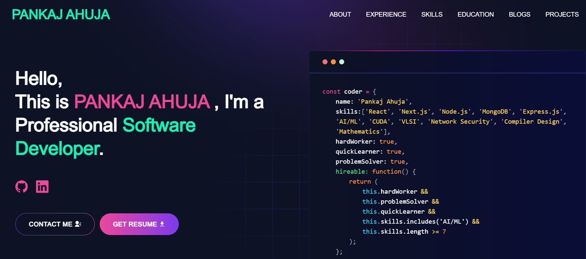

# Developer Portfolio
This Developer Portfolio template allows you to create your very own personalized portfolio website! It's designed to be user-friendly and easily customizable, making it perfect for both developers and designers.



## View live preview [here]().

---

## Table of Contents :scroll:

- [Sections](#sections-bookmark)
- [Installation](#installation-arrow_down)
- [Getting Started](#getting-started-dart)
- [Usage](#usage-joystick)
- [Deployment](#deployment-rocket)
- [Packages Used](#packages-used-package)

---

# Sections :bookmark:

- HERO SECTION
- ABOUT ME
- EXPERIENCE
- SKILLS
- PROJECTS
- EDUCATION
- CONTACTS

---

# Installation :arrow_down:

### You will need to download Git and Node to run this project

- [Git](https://git-scm.com/downloads)
- [Node](https://nodejs.org/en/download/)

#### Make sure you have the latest version of both Git and Node on your computer.

```bash
node --version
git --version

---

# Getting Started :dart:

### Fork and Clone the repo

To Fork the repo click on the fork button at the top right of the page. Once the repo is forked open your terminal and perform the following commands

```bash
git clone https://github.com/<YOUR GITHUB USERNAME>/developer-portfolio.git
cd developer-portfolio
```

### Install packages from the root directory

```bash
npm install
# or
yarn install
```

Then, run the development server:

```bash
npm run dev
# or
yarn dev
```

Open [http://localhost:3000](http://localhost:3000) with your browser to see the result.

---

# Usage :joystick:

### Customize data in the `utils/data` folder.

Eg:

```javascript
export const personalData = {
  name: "Your Name",
  profile: "/your-profile-picture.png",
  designation: "Software Developer",
  description: "Your description...",
  email: "your.email@example.com",
  phone: "+1234567890",
  address: "Your City, Country",
  github: "https://github.com/yourusername",
  linkedIn: "https://www.linkedin.com/in/yourprofile/",
  // Add other social media links as needed
};
```

---

# Deployment :rocket:

You can deploy this portfolio to various platforms. Here are instructions for Vercel, Netlify, and GitHub Pages.

## Deploying to Vercel:

1. Sign up or log in to [Vercel](https://vercel.com/).
2. Click on "New Project" and select your GitHub repo.
3. Follow the prompts to deploy your application.

## Deploying to Netlify:

1. Sign up or log in to [Netlify](https://www.netlify.com/).
2. Click "New site from Git" and select your GitHub repo.
3. Follow the prompts to deploy your application.

## Deploying to GitHub Pages:

1. Install the `gh-pages` package: `npm install gh-pages --save-dev`
2. Add deployment scripts to `package.json`.
3. Create a GitHub Actions workflow for automatic deployment.
4. Update `next.config.js` for GitHub Pages compatibility.
5. Push changes and set up GitHub Pages in your repo settings.

For detailed instructions on GitHub Pages deployment, refer to the Next.js documentation or create an issue for assistance.

---

# Packages Used :package:

- next
- react
- react-dom
- react-icons
- sass
- tailwindcss
- (other packages as needed for your specific implementation)

---

# FAQ:

1. For those facing the issue of "`next` is not recognized as an internal or external command, operable program or batch file."

Run the following command:

```bash
npm install -g next
```

This installs Next.js globally. Then run `npm run dev` as usual.